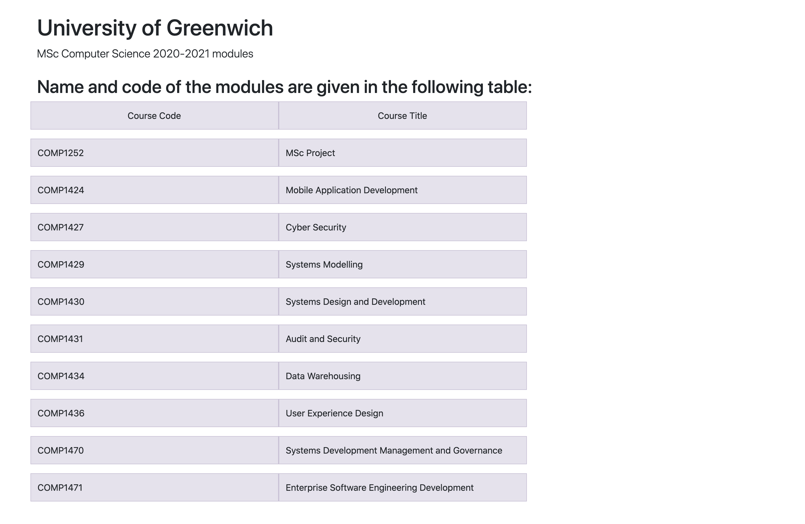
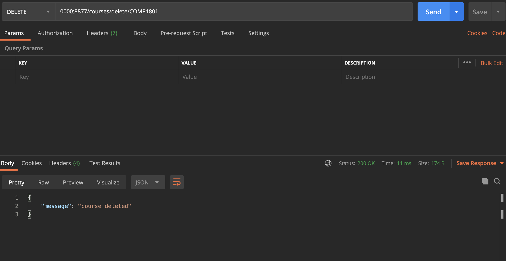

# University of Greenwich 
# MSc Computer Science Modules (Sample)

##Screenshot of course list homepage

## Create JSON response from query string

## List of courses in JSON format

## Find course title with course code

## Add course using POST method

## Delete course using DELETE method

# Containerization with Docker

## Docker Image

## Docker container 

## Docker container stats

